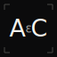

# `alanchester-brand`

> **For any ε &gt; 0, there exists a δ &gt; 0.**
> The personal brand system of [Alan Chester](https://github.com/amcheste).
> Tokens, components, and assets — everything I need to identify my work in code.

[](LICENSE)
[](package.json)

---

## What this is

This is the **system layer** of my personal brand, expressed as code. It's the
canonical source for:

- 🎨 **Design tokens** — colors, type, spacing — as CSS variables and JSON
- 🔠 **Logo components** — Monogram, Wordmark, EpsilonDelta — as React components
- 🖼️ **Static assets** — SVG and PNG exports of every mark
- 📄 **The brand document** — a 13-page PDF that explains the whole system

The goal is durability. Anything I build that needs my name on it — a personal
site, a slide deck, a README, a side project — pulls its identity from here.
When the brand evolves, it evolves *here* and propagates outward.

---

## The one-line philosophy

```
∀ ε > 0, ∃ δ > 0
```

The formal definition of a limit, in seven characters.

- **ε** is the standard the world demands. Define it before the work.
- **δ** is the move — the pivot, the input, the change in approach — that lands inside ε.
- The promise of the equation is that no matter how tight ε gets, a δ *exists*. The work is finding it.

The whole system is downstream of that line. See [`docs/brand-document.pdf`](docs/) for the full story.

---

## Quick start

### As an installable package

```bash
npm install @amcheste/brand
```

```jsx
// Import the tokens once, anywhere in your app's CSS pipeline:
import "@amcheste/brand/tokens";

// Then use the components:
import { Monogram, Wordmark, EpsilonDelta } from "@amcheste/brand";

export default function Header() {
  return (
    <header>
      <Monogram size={48} />
      <Wordmark size={32} />
      <EpsilonDelta variant="logo" />
    </header>
  );
}
```

### Without React (just the visual primitives)

```html
<!-- Drop in the tokens -->
<link rel="stylesheet" href="node_modules/@amcheste/brand/tokens/index.css">

<!-- Use the SVGs directly -->


```

### Without npm at all

Copy the files you need from `tokens/`, `components/`, and `assets/` straight
into your project. The package is intentionally small and dependency-free for
exactly this reason.

---

## The system

### Color

| Token              | Hex        | Job                                              |
| ------------------ | ---------- | ------------------------------------------------ |
| `--ac-ink`         | `#0B0B0C`  | primary text, monogram fill                      |
| `--ac-graphite`    | `#2B2B2E`  | body copy                                        |
| `--ac-muted`       | `#8A8A8E`  | captions, eyebrows, page numbers                 |
| `--ac-mist`        | `#E6E4DE`  | dividers, hairlines                              |
| `--ac-paper`       | `#F6F4EE`  | canonical background                             |
| `--ac-accent`      | `#1F6B3A`  | **the data, the pivot, the δ** *(rule below)*    |
| `--ac-accent-alt`  | `#B45A3C`  | rust · alternate accent (rarely used)            |

### The accent rule (read this)

`#1F6B3A` is **scarce on purpose**. It does exactly one job:
> **Green = the data, the pivot, the δ.**

Every place you see green, something *changed* — a finding, an inflection, a result.

**Do** apply it to:
- ε in any equation (the standard the data sets)
- The inflection point in a chart or timeline
- The "result" column in any notebook layout
- The noun in body copy that names the finding

**Don't** apply it to:
- Eyebrows, page numbers, dividers, section tags (decoration)
- Headlines (they're claims, not findings)
- Generic emphasis on opinions

If a green element doesn't represent **data, evidence, or a pivot** — demote it
to ink. The full ruleset lives on page 9 of the brand document.

### Type

| Family             | Used for                                       |
| ------------------ | ---------------------------------------------- |
| **IBM Plex Sans**  | Body copy, headlines                           |
| **IBM Plex Mono**  | Monogram, equations, labels, eyebrows          |
| **IBM Plex Serif** | (Reserved · long-form essays only)             |

Plex is the only family. Sans for prose, Mono for everything mathematical or
structural. The full type scale is in [`tokens/typography.css`](tokens/typography.css).

### Marks

| Mark                                                         | Component        | SVG asset                       |
| ------------------------------------------------------------ | ---------------- | ------------------------------- |
|  Monogram (solid)      | `<Monogram />`   | `assets/monogram-solid.svg`     |
| Monogram (outline)                                           | `variant="outline"` | `assets/monogram-outline.svg` |
| Monogram (accent)                                            | `variant="accent"`  | `assets/monogram-accent.svg`  |
| Wordmark · `alan chester.`                                   | `<Wordmark />`   | `assets/wordmark.svg`           |
| Equation · `∀ ε > 0, ∃ δ > 0`                                | `<EpsilonDelta />` | `assets/epsilon-delta.svg`    |

The monogram is **A · ε · C**. The ε is set at exactly 50% of the cap-height of
A and C, vertically centered. Don't redraw it; use the components or SVGs.

---

## What's in the box

```
.
├── tokens/                  Design tokens (the foundation)
│   ├── colors.css           CSS variables
│   ├── typography.css       Type scale, families, tracking, leading
│   ├── colors.json          Tokens as data (for tooling)
│   ├── tokens.json          Everything as data (single source)
│   └── index.css            One-file import
│
├── components/              React components (the runtime)
│   ├── Monogram.jsx         The AεC mark
│   ├── Wordmark.jsx         "alan chester."
│   ├── EpsilonDelta.jsx     The signature equation
│   └── index.js             Barrel export
│
├── assets/                  Static exports (the universal fallback)
│   ├── monogram-solid.svg
│   ├── monogram-outline.svg
│   ├── monogram-accent.svg
│   ├── wordmark.svg
│   └── epsilon-delta.svg
│
├── docs/
│   └── brand-document.pdf   The full 13-page brand document
│
└── examples/
    └── index.html           A living showcase (open in a browser)
```

---

## Versioning

Brand versions are dated: **`YYYY.MM.PATCH`**. The current version is
**`2026.04.0`** — April 2026, initial publication.

A bump to the *minor* (month) component means the system extended:
new tokens, new components. A bump to *patch* means a fix:
typo, color tweak, asset re-export. The major (year) changes when the
core philosophy does — which should be never.

---

## Contributing

This is a personal brand. It's **MIT-licensed** because the code primitives
are useful — feel free to study them, fork the structure, learn from the
patterns. But the marks (`AεC`, the `alan chester.` wordmark, the equation
as identity) are mine; please don't represent yourself with them.

If you spot a bug in the code — a token mismatch, a broken SVG, a typo — open
a PR. The notebook is open.

---

## License

[MIT](LICENSE) · © 2026 Alan Chester
